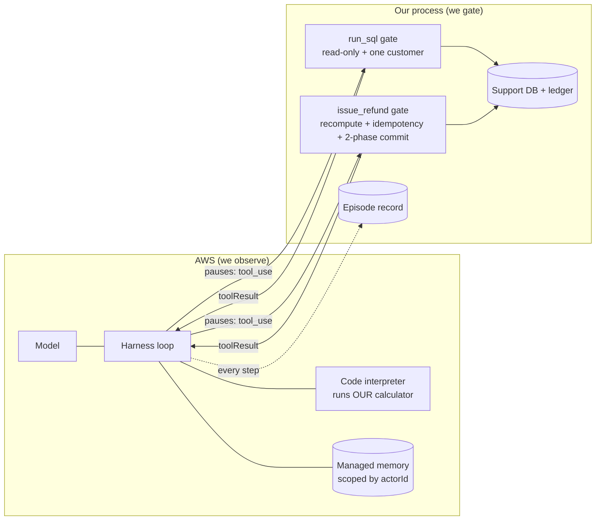

# agentcore-harness-demo

A production-style harness around a non-deterministic agent, on **Amazon
Bedrock AgentCore**. Domain: e-commerce returns and refunds support.

**The ticket:** *"Order #4711 arrived damaged, I want a refund."*
Resolving it correctly means reading customer data, computing money under
policy, and executing an irreversible write: three risk tiers in one request.

New to the codebase? Start with [WALKTHROUGH.md](WALKTHROUGH.md). Looking
for what to harden next? See [IMPROVEMENTS.md](IMPROVEMENTS.md).

## The idea in one picture



Anything that can move money or leak data is an `inline_function`: the
harness **pauses** and hands control to code we own. The gate is not in
the model's environment, so it cannot be prompt-injected or argued with.

## Three concepts

| Concept | What it is | Where |
|---|---|---|
| **Harness** | The managed loop that calls the model and its tools | [harness_demo/agent/client.py](harness_demo/agent/client.py) |
| **Episode** | The audit record of one ticket: both sides of the trust boundary, cost, stop reasons | [harness_demo/agent/episode.py](harness_demo/agent/episode.py) |
| **Memory** | Per-customer facts: write (instant) -> extract (async) -> retrieve by `actorId` | [harness_demo/agent/memory.py](harness_demo/agent/memory.py) |

## Gates before money moves

Preceded by a **scope check**: the order must belong to the session's
customer, and the refusal is identical to "order not found".

1. **Schema**: Pydantic contract on the tool boundary.
2. **Independent recompute**: we re-run the policy engine and refuse any
   disagreement with the agent's figure. That includes
   `days_since_delivery`, derived from `orders.delivered_on`: it decides
   eligibility, so trusting it would check the arithmetic but not the
   decision.
3. **Idempotency**: the key hashes `(order_id, reason, amount)` and is the
   `PRIMARY KEY` of `refund_intents`, so the guarantee is a database
   constraint, not application logic a race can slip between.
4. **Two-phase commit**: `PENDING` before the effect, `COMMITTED` after; a
   failure mid-flight triggers a compensating rollback.

`run_sql` has four layers: a SELECT-only contract, a read-only connection,
an authorizer, and per-customer views, so a session can only ever see its
own customer's rows (see [harness_demo/db.py](harness_demo/db.py)).

The policy calculator is **shipped, not model-generated**: a sandbox does
not make arithmetic deterministic if the model writes the arithmetic. It is
copied onto the microVM over the harness shell WebSocket, and the same
module is imported by the gate to verify. Money is `Decimal` end to end.

## Layout

```
harness_demo/
  config.py            Settings; harness ARN resolved lazily, never at import
  db.py                SupportDb, seed data, per-customer scoped connections
  errors.py            HarnessError, ConfigError, EpisodeAborted, ...
  policy/              refund_calc.py: deterministic rules (stdlib only)
  guardrails/          sql_gate, refund_gate, ledger, budget, toolbox
  agent/               client, stream, episode, memory, sandbox, prompt, tools, observer
  demo/                narration (text), beats (logic), run (entry point)
tools/episode_report.py   read saved episodes
evals/                    tier 1 (offline) and tier 2 (live)
docs/sample_episode.json  a real episode record
demo_run.py               thin entry point for the recording
```

The library never prints. `HarnessClient.run_episode` reports events to an
observer; the demo plugs in `ConsoleObserver`, tests plug in nothing.

## Run it

```powershell
python -m pip install -r requirements.txt   # boto3, pydantic, pytest, websockets
.\setup.ps1                                 # AWS resources (bash setup.sh on Linux/macOS)
python -m pytest evals/test_invariants.py -v   # offline, no model calls, ~1s
python demo_run.py                          # the recorded scenario (reseeds itself)
python demo_run.py --pause                  # wait for Enter between beats
python tools/episode_report.py              # what did past episodes do?
python -m pytest evals/test_trajectory.py -v -s  # live runs + isolation (needs HARNESS_ARN)
```

`HARNESS_ARN` is used if set; otherwise the harness named `support_agent`
is looked up (override with `HARNESS_NAME`). `AWS_REGION` defaults to
`us-east-1`. Add `--log-level INFO` for the operational log.

Use **one** interpreter and invoke the tests as `python -m pytest`. A bare
`pytest` resolves independently of `python`, so a machine with two
environments will happily run the demo on one and the tests on the other.

### AWS permissions

- **Harness execution role** (`AgentCoreHarnessLabRole`): the setup scripts
  attach `AgentCoreMemory` and `BedrockInvoke`. Without `BedrockInvoke` the
  run fails with `AccessDenied` on `InvokeModelWithResponseStream`.
- **Caller**: `InvokeHarness`, `InvokeAgentRuntimeCommandShell` (seeding the
  calculator), `ListHarnesses`, `GetHarness`, `GetMemory` and
  `ListMemoryRecords`.

### Memory timing

Fact extraction is asynchronous and can take several minutes.
`wait_for_facts` polls for up to 10 minutes before Beat 5. If the wait times
out, stop the take: Beat 5 would run with cold memory.

## Two-tier eval strategy

Tier 1 (`evals/test_invariants.py`) is deterministic and offline: it runs
on every commit because the harness is ordinary software. Tier 2
(`evals/test_trajectory.py`) makes live model calls and asserts on the
*distribution* across N runs; it runs on a schedule. Memory isolation is
the exception: it is a security property, so one failure fails the suite.

## The six beats

1. **Read-only gate**: `UPDATE`, `DELETE`, `DROP` and a stacked
   `SELECT 1; UPDATE ...` are all blocked.
2. **The agent works the ticket**: the code interpreter runs *our*
   calculator -> **$172.03**, and `issue_refund` commits after the
   independent recompute agrees.
3. **Amount gate**: `$999.00` and a 96-cent slip are refused; the correct
   figure collapses onto the refund the agent just made.
4. **Retry storm**: the same action replayed 3x; the ledger keeps one row.
5. **New session, same customer**: memory answers without a database lookup.
6. **New customer**: nothing carries across, proved three ways: facts per
   actor at the memory store, rows per session in the database, and only
   then the agent's own answer.

Beats 1 and 3 are driven by us, not by the agent. Given the schema up
front, the agent never reaches for `UPDATE`, and when its figure matches
the policy there is nothing to refuse. Calling the gates directly is the
more honest demonstration: the guarantees hold whether or not the model
misbehaves on camera. Each is also proved offline in
`evals/test_invariants.py`.
