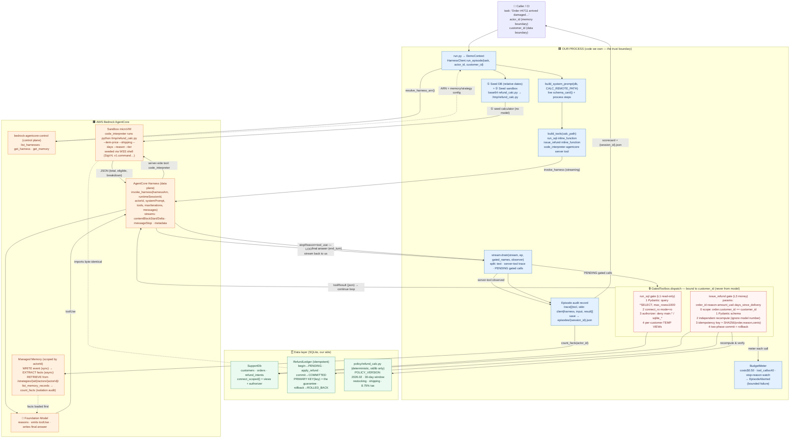

# AgentCore Harness Demo — Architecture Flow

End-to-end flow for working one returns/refund ticket. The **trust boundary** is the
core idea: anything that can move money or leak data is an `inline_function`, so the
harness **pauses** and hands control back to code we own (the gates) instead of the
model's environment.



## How to read it

- **Blue = our process** (the harness client, gates, episode). **Orange = AWS AgentCore**
  (control plane, harness loop, model, sandbox, managed memory). **Green = our data layer**
  (SQLite + deterministic policy). **Red = the gates** where every money/data action is decided.
- **The pause is the point.** When the model calls a gated `inline_function`
  (`run_sql`, `issue_refund`), the harness returns `stopReason=tool_use` and the loop
  pauses in our code. Nothing the model says reaches the database or ledger except through
  a gate we wrote.
- `code_interpreter` is a **server-side** AgentCore tool — it runs on the sandbox microVM
  and we only observe it (`side: "harness"`), but it runs *our* byte-identical calculator
  that we seeded before any model reasoning.
- `customer_id` (data boundary) and `actor_id` (memory boundary) come from the **calling
  application**, never from the model.

## AWS surface used

| Plane | Service · API | Purpose |
|------|----------------|---------|
| Control | `bedrock-agentcore-control:list_harnesses` / `get_harness` / `get_memory` | Resolve harness ARN, memory + strategy config |
| Data | `bedrock-agentcore:invoke_harness` (streaming) | The reason→tool→continue loop |
| Data | `bedrock-agentcore` runtime WSS shell (`v1.command.agentcore.aws.dev`, SigV4) | Seed `refund_calc.py` to the sandbox microVM |
| Data | `bedrock-agentcore:list_memory_records` | Count facts per `actorId` (isolation audit) |
| IAM | `iam:PassRole` → `AgentCoreHarnessLabRole` | Harness execution role |
```
